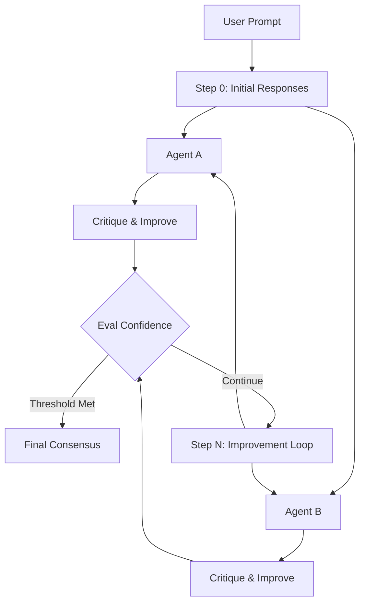

# AIQuorum


**AIQuorum** is an advanced agent network workflow designed for iterative refinement of LLM responses. By simulating a "council" of AI agents with diverse personas and instructions, AIQuorum evolves answers through cycles of critique and improvement until a consensus or confidence threshold is met.

## 🧠 How It Works

AIQuorum operates on the principle of **Iterative Refinement**. Instead of taking the first result from an LLM, we subject it to peer review.



1.  **Configure Agents**: Define `N` agents (e.g., "The Skeptic", "The Creative", "The Architect"), each targeting specific LLMs (via OpenRouter).
2.  **Set Workflow**: Define `Max Steps` and `Confidence Threshold`.
3.  **Execute**:
    *   **Step 0**: Agents provide their distinct initial answers.
    *   **Step 1 to N**: Agents read the *previous* answers, critique them, and offer an improved version.
4.  **Converge**: The system tracks confidence scores. If the threshold is crossed, it stops early.

## 🚀 Getting Started

### Prerequisites

- Python 3.12 or higher.
- An API Key (default is [OpenRouter](https://openrouter.ai/) for access to GPT-4, Claude 3, Mistral, etc.).

### Installation

Clone the repository and install in editable mode:

```bash
git clone https://github.com/JesusMF23/AIQuorum.git
cd AIQuorum
pip install -e .
```

### Usage

Check out the [Step-by-Step Guide](examples/guide.ipynb) in the `examples` folder for a detailed walkthrough.

Or run the demo script directly:

```bash
# 1. Create a .env file with your key
echo "OPENROUTER_API_KEY=sk-or-..." > .env

# 2. Run the demo
python examples/demo.py
```

## 🛠️ Configuration

You can fully customize the workflow using the `Workflow` class:

```python
from aiquorum.agents.llm import Agent
from aiquorum.workflow.engine import Workflow

agents = [
    Agent("Coder", "Write efficient Python.", model="openai/gpt-4"),
    Agent("Reviewer", "Check for bugs.", model="anthropic/claude-3-opus")
]

workflow = Workflow(agents, max_steps=5, confidence_threshold=0.95)
result = workflow.run("Implement a distributed lock.")
```

## 🤝 Contributing

We welcome contributions! Please see [CONTRIBUTING.md](CONTRIBUTING.md) for details on how to submit pull requests, report issues, and setup your development environment.

## 📜 License

This project is currently licensed under the **Apache License 2.0**.

> **Note on Commercial Use**: While the current license is Apache 2.0, the intent of the author is to protect the intellectual property of the core mechanism. Future versions or specific modules may be subject to different licensing terms to prevent unauthorized commercial exploitation without an agreement. Please check the `LICENSE` file in the specific version you are using.

---
*Built with ❤️ by JesusMF23*
